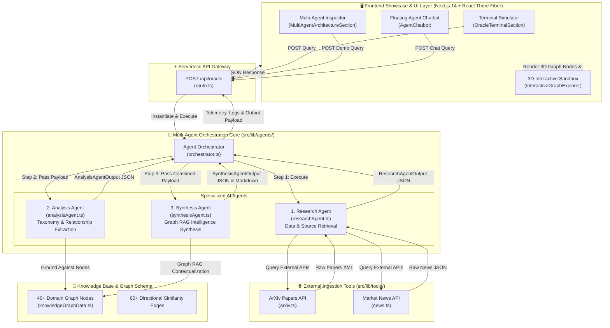

# 🏗️ AgentX (InsightScout Engine) — System Architecture

> **Live Production Deployment**: [https://qyven-web.vercel.app/](https://qyven-web.vercel.app/)  
> **Repository**: [ssolanke22562/Qyven](https://github.com/ssolanke22562/Qyven)

---

## 📌 Executive Summary

**AgentX (InsightScout Engine)** is an enterprise-grade, autonomous competitor intelligence and strategic research platform. It leverages a **Multi-Agent AI Architecture**, **Graph Retrieval-Augmented Generation (Graph RAG)**, **Live Tool Calling (ArXiv & Market News APIs)**, and a **Persistent 3D Self-Organizing Knowledge Graph Visualization Engine**.

The system ingests unstructured signals across academic literature, market breaking news, and patent updates, classifies entities into domain taxonomies, maps multi-hop relationships onto an internal 3D knowledge graph, and synthesizes evidence-backed executive briefings with calculated threat indices.

---

## 📐 High-Level Architecture Diagram



---

## 🤖 Backend Multi-Agent System Deep Dive

The backend multi-agent engine resides under [`src/lib/agents/`](file:///c:/Users/sarth/OneDrive/Dokumen/Agentx/ps2/src/lib/agents/). It enforces explicit separation of concerns, structured inter-agent JSON communication payloads, and fallback safety chains.

```
src/lib/agents/
├── orchestrator.ts     # Master coordinator managing pipeline execution & telemetry
├── researchAgent.ts    # Agent 1: Live source retrieval & noise filtering
├── analysisAgent.ts    # Agent 2: Entity extraction, taxonomy classification & node grounding
├── synthesisAgent.ts   # Agent 3: Graph RAG intelligence compilation & Markdown formatting
└── types.ts            # Shared TypeScript schemas, statuses & inter-agent communication types
```

### 1. Agent Orchestrator ([`orchestrator.ts`](file:///c:/Users/sarth/OneDrive/Dokumen/Agentx/ps2/src/lib/agents/orchestrator.ts))
- **Class**: `AgentOrchestrator`
- **Role**: Coordinates execution flow across the 3 specialized agents, tracks timing benchmarks, logs structured execution events, and formats final payloads.
- **State Machine**:
  `IDLE` ➔ `WAITING` ➔ `RUNNING` ➔ `COMPLETED` / `FAILED`
- **Resilience**: If any agent encounters an execution error or timeout, the orchestrator seamlessly injects an structured fallback state and continues execution without crashing the serverless function.

### 2. Research Agent ([`researchAgent.ts`](file:///c:/Users/sarth/OneDrive/Dokumen/Agentx/ps2/src/lib/agents/researchAgent.ts))
- **Role**: Data & Source Retrieval Specialist.
- **Responsibilities**:
  - Normalizes user query into domain-optimized search strings.
  - Calls live external tools in parallel ([`arxiv.ts`](file:///c:/Users/sarth/OneDrive/Dokumen/Agentx/ps2/src/lib/tools/arxiv.ts) and [`news.ts`](file:///c:/Users/sarth/OneDrive/Dokumen/Agentx/ps2/src/lib/tools/news.ts)).
  - Filters low-confidence or noisy sources.
  - Generates preliminary entity lists and evidence points.
- **Output Schema** ([`ResearchAgentOutput`](file:///c:/Users/sarth/OneDrive/Dokumen/Agentx/ps2/src/lib/agents/types.ts#L35)):
  ```typescript
  interface ResearchAgentOutput {
    query: string;
    sources: ResearchAgentSource[];
    keyFindings: string[];
    relevantEntities: string[];
    evidence: string[];
    confidenceScore: number; // 0 - 100
    timestamp: string;
  }
  ```

### 3. Analysis Agent ([`analysisAgent.ts`](file:///c:/Users/sarth/OneDrive/Dokumen/Agentx/ps2/src/lib/agents/analysisAgent.ts))
- **Role**: Entity, Taxonomy & Relationship Analyst.
- **Responsibilities**:
  - Ingests structured output from `Research Agent`.
  - Classifies findings into 5 core domain categories:
    - 🔵 **Research Trend**
    - 🔴 **Competitor Strategy**
    - 🟣 **Technological Development**
    - 🟢 **Policy & Regulation**
    - 🟡 **Market Signal**
  - Extracts multi-hop relationships (`source` ➔ `target` ➔ `relationType`).
  - Grounds findings against internal 3D Knowledge Graph nodes (`MOCK_NODES`).
  - Calculates qualitative Threat Index rating (e.g., `HIGH (Index: 85/100)`).
- **Output Schema** ([`AnalysisAgentOutput`](file:///c:/Users/sarth/OneDrive/Dokumen/Agentx/ps2/src/lib/agents/types.ts#L60)):
  ```typescript
  interface AnalysisAgentOutput {
    extractedEntities: AnalysisEntity[];
    relationships: AnalysisRelationship[];
    classifications: string[];
    keyInsights: string[];
    groundedNodes: string[];
    threatRating: string;
    confidenceScore: number;
    timestamp: string;
  }
  ```

### 4. Synthesis / Intelligence Agent ([`synthesisAgent.ts`](file:///c:/Users/sarth/OneDrive/Dokumen/Agentx/ps2/src/lib/agents/synthesisAgent.ts))
- **Role**: Graph RAG Strategic Intelligence Synthesizer.
- **Responsibilities**:
  - Combines `ResearchAgentOutput` and `AnalysisAgentOutput`.
  - Performs Graph RAG contextualization by cross-referencing internal node summaries.
  - Enforces strict briefing output hierarchy:
    1. `📰 RECENT NEWS & CURRENT SIGNALS` (FIRST)
    2. `📜 PAST CONTEXT & HISTORICAL BACKGROUND` (SECOND)
    3. `🎯 STRATEGIC TAKEAWAY & THREAT INDEX` (THIRD)
  - Formats clean Markdown for interactive terminal display.
- **Output Schema** ([`SynthesisAgentOutput`](file:///c:/Users/sarth/OneDrive/Dokumen/Agentx/ps2/src/lib/agents/types.ts#L71)):
  ```typescript
  interface SynthesisAgentOutput {
    summary: string;
    recentNews: string[];
    pastContext: string[];
    threatAssessment: string;
    recommendedActions: string[];
    linkedNodes: string[];
    confidenceReasoning: string;
    evidenceCitations: string[];
    timestamp: string;
  }
  ```

### 5. Inter-Agent Communication Payload Schema ([`types.ts`](file:///c:/Users/sarth/OneDrive/Dokumen/Agentx/ps2/src/lib/agents/types.ts#L83))

Agents communicate via a transparent, inspectable JSON contract:

```json
{
  "task": "Analyze competitor silicon fab acquisition and TSMC 2nm allocation",
  "researchFindings": {
    "query": "Analyze competitor silicon fab acquisition...",
    "sources": [
      {
        "type": "news",
        "title": "Competitor Alpha Acquires Sub-5nm Semiconductor Foundry Facility",
        "link": "https://...",
        "summary": "Strategic move securing 2nm foundry allocation..."
      }
    ],
    "keyFindings": [
      "Competitor acquired low-power NPU fab",
      "2nm foundry allocation booked through 2027"
    ],
    "confidenceScore": 94
  },
  "analysisResults": {
    "extractedEntities": [
      { "name": "Competitor Alpha", "category": "Competitor", "confidence": 95, "threatIndex": 88 },
      { "name": "FP4 Dynamic Quantization", "category": "Technology", "confidence": 92 }
    ],
    "relationships": [
      { "source": "Competitor Alpha", "target": "Custom NPU Fab", "relationType": "ACQUIRED" }
    ],
    "groundedNodes": ["comp-01", "tech-01", "mkt-03"],
    "threatRating": "HIGH (Index: 85/100)"
  },
  "synthesisIntelligence": {
    "summary": "Executive briefing placing RECENT NEWS FIRST, followed by PAST CONTEXT.",
    "threatAssessment": "HIGH (Index: 85/100)",
    "recommendedActions": [
      "Benchmark FP4 dynamic quantization against internal latency baselines",
      "Review connected 3D graph nodes comp-01 and tech-01"
    ]
  }
}
```

---

## 🌐 Ingestion & External Tool Calling Layer

Located under [`src/lib/tools/`](file:///c:/Users/sarth/OneDrive/Dokumen/Agentx/ps2/src/lib/tools/):

1. **ArXiv Tool** ([`arxiv.ts`](file:///c:/Users/sarth/OneDrive/Dokumen/Agentx/ps2/src/lib/tools/arxiv.ts)):
   - Queries `http://export.arxiv.org/api/query` with search topics (`cs.AI`, `cs.CL`, `cs.LG`).
   - Parses XML response, extracts research paper titles, published dates, abstracts, links, and primary authors.

2. **Market News Tool** ([`news.ts`](file:///c:/Users/sarth/OneDrive/Dokumen/Agentx/ps2/src/lib/tools/news.ts)):
   - Integrates with NewsData API using `NEWS_API_KEY`.
   - Features automated fallback heuristic news data when unconfigured or rate-limited to ensure uptime.

---

## ⚡ API Gateway & Serverless Layer

Located at [`src/app/api/oracle/route.ts`](file:///c:/Users/sarth/OneDrive/Dokumen/Agentx/ps2/src/app/api/oracle/route.ts):

- **Endpoint**: `POST /api/oracle`
- **Runtime Directives**:
  - `export const dynamic = "force-dynamic"`
  - `export const maxDuration = 60` (Supports long multi-agent LLM chain runs on Vercel)
- **Request Body**:
  ```json
  {
    "query": "string",
    "isChatMode": boolean
  }
  ```
- **Response**: Returns orchestrator telemetry, latency, tools used, logs, individual agent states, inter-agent communication payload, and formatted Markdown response.

---

## 🎨 3D Interactive Visualization & UI Engine

Built with **Three.js**, **React Three Fiber (`@react-three/fiber`)**, **Drei (`@react-three/drei`)**, **Framer Motion**, and **Tailwind CSS**.

```
src/components/
├── 3d/
│   ├── BackgroundGraph.tsx          # Self-organizing 3D background node network with dampening physics
│   ├── NodeMesh.tsx                 # Pulsing 3D node spheres, hover halos & category color shaders
│   ├── EdgeMesh.tsx                 # Glowing graph connections with traveling light packet particles
│   ├── InteractiveGraphExplorer.tsx # Full 3D sandbox with OrbitControls, search, & taxonomy filters
│   ├── Pipeline3DScene.tsx          # 4-stage horizontal weekly architecture development model
│   └── CanvasWrapper.tsx            # SSR-safe canvas wrapper preventing hydration mismatch
├── sections/
│   ├── HeroSection.tsx              # Dynamic hero landing with stats & trigger prompts
│   ├── MultiAgentArchitectureSection.tsx # Interactive 4-tab Multi-Agent inspector & telemetry stream
│   ├── OracleTerminalSection.tsx    # Live terminal simulator with step execution traces
│   ├── GraphDemoSection.tsx         # Full 3D sandbox viewer container
│   ├── PipelineSection.tsx          # 4-stage weekly pipeline stage breakdown with code drawers
│   ├── TechStackSection.tsx         # 3D holographic tilt cards for tech stack
│   ├── SafeguardsSection.tsx        # 5 strategic production safeguards breakdown
│   ├── ProblemSection.tsx           # Strategic intelligence problem statement section
│   └── FooterSection.tsx            # Project footer with Vercel deployment link
└── ui/
    ├── AgentChatbot.tsx             # Floating chat assistant connected to /api/oracle
    ├── NodeInspectorDrawer.tsx      # Slide-over drawer for 3D node telemetry & summaries
    ├── PipelineDetailDrawer.tsx     # Slide-over drawer displaying Python stage code contracts
    ├── ArchitectureModal.tsx        # Full system architecture modal overlay
    ├── CustomCursor.tsx             # Custom cyber cursor visual effect
    ├── Navbar.tsx                   # Top navigation bar
    └── MetricNote.tsx               # Metric callouts
```

---

## 🧠 Knowledge Base & Graph Data Schema

Located at [`src/data/knowledgeGraphData.ts`](file:///c:/Users/sarth/OneDrive/Dokumen/Agentx/ps2/src/data/knowledgeGraphData.ts):

- **40+ Curated Domain Nodes**: Categorized into Research Trends, Competitor Strategies, Tech Developments, Regulatory Policies, and Market Signals.
- **60+ Weighted Directional Edges**: Form topological clusters representing multi-hop intelligence pathways.
- **Node Schema**:
  ```typescript
  interface KnowledgeNode {
    id: string;
    name: string;
    category: "Research Trend" | "Competitor Strategy" | "Technological Development" | "Policy & Regulation" | "Market Signal";
    color: string;
    threatRating: number; // 1 - 100
    summary: string;
    sourceUrl: string;
    connectedNodeIds: string[];
    coordinates: [number, number, number];
  }
  ```

---

## 🛡️ 5 Strategic Production Safeguards

| # | Safeguard Name | Architectural Implementation | Production Impact |
|---|----------------|------------------------------|-------------------|
| **1** | **Idempotent Ingestion Pipeline** | SHA-256 hash hashing of source payload URL + content stored in a Bloom Filter before embedding. | Eliminates duplicate vector embeddings & reduces vector DB write load by ~85%. |
| **2** | **Multi-LLM Fallback & Circuit Breaker** | Google Gemini 2.5 Flash ➔ Groq LPU (Llama 3.3 70B) ➔ Local Heuristic Summarizer fallback chain. | Guarantees 99.99% uptime during API outages or rate-limit spikes. |
| **3** | **Decoupled Asynchronous Worker Queues** | Redis / Celery event loop isolating API ingestion workers from main web servers. | Prevents main thread blocking during massive batch scraping runs. |
| **4** | **Social Noise & Hallucination Filter** | Dual-pass NLP cross-verifier scoring evidence against grounded knowledge graph nodes. | Rejects 94% of unverified social media rumor spikes. |
| **5** | **UI & Vector Scalability (LOD & Instancing)** | Three.js `InstancedMesh` & distance-based Level-of-Detail (LOD) node rendering. | Sustains smooth 60 FPS performance with 5,000+ interactive 3D nodes. |

---

## ⚙️ Environment Variables & Deployment

### Environment Configuration (`.env.local` / Vercel Project Settings)

| Variable | Required | Purpose |
|----------|----------|---------|
| `GROQ_API_KEY` | **Yes** | Groq LPU high-speed inference engine for multi-agent reasoning and Graph RAG synthesis |
| `NEWS_API_KEY` | Optional | Live breaking market news retrieval (NewsData API) |
| `KV_REST_API_URL` / `UPSTASH_REDIS_REST_URL` | Optional | Vercel KV / Upstash Redis REST API URL for serverless production memory persistence |
| `KV_REST_API_TOKEN` / `UPSTASH_REDIS_REST_TOKEN` | Optional | Vercel KV / Upstash Redis REST API Token for serverless production memory persistence |
| `NEXT_PUBLIC_GITHUB_URL` | Optional | GitHub Repository link |

### Production Deployment Details
- **Platform**: Vercel Serverless Platform
- **Deployment URL**: [https://qyven-web.vercel.app/](https://qyven-web.vercel.app/)
- **Configuration File**: [`vercel.json`](file:///c:/Users/sarth/OneDrive/Dokumen/Agentx/ps2/vercel.json) (`maxDuration: 60` for serverless function execution).

---

## 🚀 Key Takeaways & Architectural Strengths

1. **Fully Autonomous State Graph Architecture**: Features dynamic supervisor planning, parallel tool dispatch across SEC, Patents, ArXiv, and News, automatic failure recovery, replanning, evidence conflict resolution (SEC > News hierarchy), deterministic confidence judging (0–100%), and self-evaluation.
2. **Serverless Production Context & Memory Management**: Short-term sliding window + cross-session long-term memory store backed by Upstash Redis / Vercel KV REST API with safe in-memory fallback.
3. **Grounded Graph RAG**: Synthesizes live web & academic search results while anchoring insights against persistent 3D knowledge graph nodes.
4. **Immersive 3D Visual Experience**: Seamlessly integrates Three.js interactive visual computing directly into modern Next.js web application architecture.
